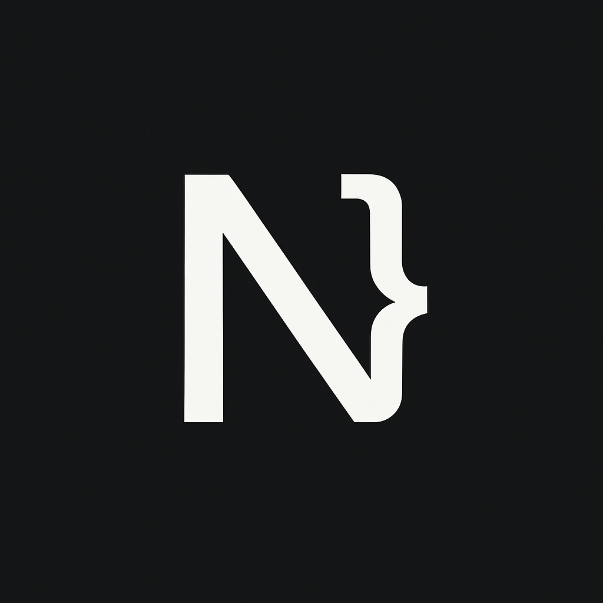

# 🚀 Nishant's Portfolio

A modern, responsive developer portfolio built with React, Vite, and Tailwind CSS. Showcasing full-stack projects, AI-powered tools, and modern web solutions.



---

## 🌟 Features

- Responsive design for all devices
- Animated project slider with live demos
- Smooth scroll and reveal animations
- Contact form with EmailJS integration
- Dark/light mode support
- Modern UI with Tailwind CSS

---

## 🛠️ Tech Stack

- **Frontend:** React, Vite, Tailwind CSS, React Icons
- **Email:** EmailJS
- **Deployment:** Vercel / GitHub Pages

---

## 🧩 Main Projects

| Project       | Description                                                      | Tech Stack                                                           | Live Demo                                                                                      |
| ------------- | ---------------------------------------------------------------- | -------------------------------------------------------------------- | ---------------------------------------------------------------------------------------------- |
| **CiteMind**  | AI-powered research platform for visualizing academic literature | Next.js, HuggingFace, Pinecone, MongoDB, Chart.js, D3.js, TypeScript | [Live](https://citemiind.vercel.app/) / [Code](https://github.com/NishantRaj278/CiteMind)      |
| **Socialure** | Full-stack social media platform                                 | Next.js, PostgreSQL, Prisma, TypeScript, Tailwind CSS                | [Live](https://socialure.vercel.app/) / [Code](https://github.com/NishantRaj278/Socialure)     |
| **CraftAI**   | AI tool to generate React components from prompts                | Next.js, MongoDB, Node.js, Express, TypeScript, Tailwind CSS         | [Live](https://craft-ai-pi.vercel.app/) / [Code](https://github.com/NishantRaj278/craftAI)     |
| **Inklet**    | Dynamic blogging platform                                        | Next.js, MongoDB, Prisma, TypeScript, Tailwind CSS                   | [Live](https://inklet-seven.vercel.app/) / [Code](https://github.com/NishantRaj278/Inklet)     |
| **HelpHive**  | Community platform for local help and messaging                  | React, Node.js, Express, MongoDB, Socket.IO, Tailwind CSS            | [Live](https://helphiive.vercel.app/) / [Code](https://github.com/NishantRaj278/HelpHive)      |
| **ChatNest**  | Real-time chat app with media sharing                            | React, Node.js, Express, MongoDB, Tailwind CSS, Socket.IO            | [Live](https://chatnest-1-1.onrender.com/) / [Code](https://github.com/NishantRaj278/ChatNest) |

---

## 🚦 Getting Started

1. **Clone the repo:**
   ```sh
   git clone https://github.com/NishantRaj278/Portfolio.git
   cd nishant-portfolio
   ```
2. **Install dependencies:**
   ```sh
   npm install
   ```
3. **Run the development server:**
   ```sh
   npm run dev
   ```
4. **Build for production:**
   ```sh
   npm run build
   ```

---

## 📬 Contact

Want to connect or collaborate? Reach out via the contact form on the site or email me at [nishant.raj278@gmail.com](mailto:nishant.raj278@gmail.com).

---

## 📄 License

This project is open source and available under the [MIT License](LICENSE).
